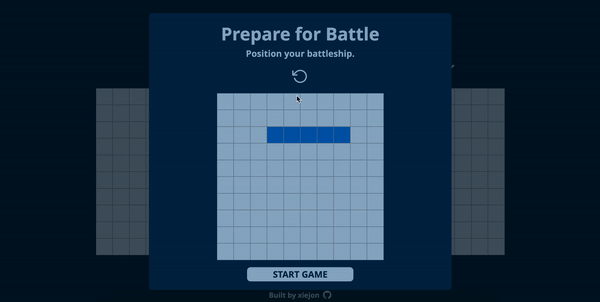

# Battleship

A single-player implementation of Battleship, focusing on TTD using Jest, as part of The Odin Project's Full-Stack JS course. 

Viewable at https://xiejon.github.io/battleship/

## Objectives 

1. Practice unit-testing & mocking using Jest.
2. Use Test Driven Development to improve quality and effectiveness of code. 
3. Create a simple AI for the user to play against.

## Overview

1. User positions their ships. 
2. The game begins.
3. User makes the first move. 
4. Computer attacks back. 
5. Once all ships are sunk, alert the winner and end the game.

## Challenges 

1. Placing a ship
    - Working out the logic behind positioning a ship on the grid both vertically and horizontally took some time. 

2. Positioning grid
    - I settled on creating a grid of xy coordinates. I added these xy coordinates to each DOM element in order to locate the element that the user clicked on. In order to get everything positioned correctly, I had to create a separate div for each column. While I applied flex-row for the entire grid, I added flex-column-reverse on the column div. The end result:
    

3. DOM
    - When I started working on the DOM module, my code began getting messy. I wasn't sure where to place the event listeners or how many functions to create. From my past mistakes, I wanted to minimize the number of parameters I included in a function, in order to improve clarity. In the future, I would pay more attention to testing and planning the DOM interaction in order to avoid closely coupled code. I am looking forward to diving into React, which I know offers tools to easily test the appearance of a page. 

## Areas for Improvement

- Privacy. Part of my DOM logic involves adding a "ship-present" attribute to any boxes with a ship. This can be viewed in the HTML element. For a single-player app such as this one, this is OK, however a multiplayer game would require more care on my part in regards to data privacy. 

- Code quality. I discovered ESLint when I was almost finished with the app. I wish I had taken advantage of this tool earlier on. I see that I created several unnecessary code dependencies, mainly later on once I started working on the DOM manipulation, that ultimately make my code weaker, more obscure, and harder to debug. In the future, I need to refactor earlier and more frequently, in order to prevent this from happening. As I practice more with TTD, I think this would also help me to organize my code by work towards smaller, clearer goals.